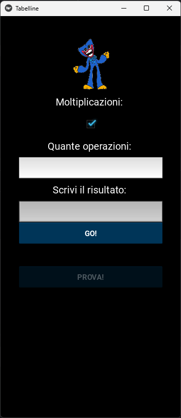

# Mobile app with Kivy framework

## This project shows an example of Android application using Kivy framework.

### To getting started follow below steps:

1. Install kivy library
2. Inherits the class App of kivy as in main.py
3. Define UI and backend logics according kivy documentation
4. Open Google Colab session.
5. Execute the commands in file: kivy_app_generation.txt (answer yes if asked)
6. The process generated a file named buildozer.spec; open this file and set to 1 the option fullscreen
7. Upload to Colab the file logo.png
8. Upload to Colab the file main.py
9. Launch the command: 
   > !buildozer -v android debug

10. When finished it'll be generated a file named myapp-0.1-arm64-v8a_armeabi-v7a-debug.apk in the folder bin
11. Install the file on Android smartphone; since the app ins't onto Play Store you should enable the "Installation from unknown source" in your smartphone 
12. Enjoy it

# Scope of application:
it is a simple application to learn the use of the kivy framework, in any case its purpose is to create a simple program to teach multiplication tables or division.

